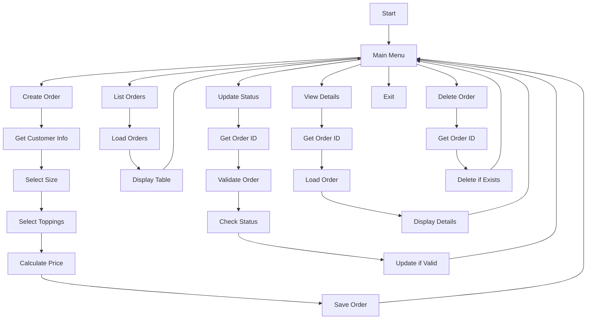

# PyPzza

A simple CLI application to manage pizza orders, built with Python.

## Setup

1. Create and activate virtual environment:

```bash
python -m venv .venv
source .venv/bin/activate  # On Windows: .venv\Scripts\activate
```

2. Install dependencies:

```bash
pip install -r requirements.txt
```

3. Run the application:

```bash
python src/main.py
```

## Features

- Create and manage pizza orders
- Track order status
- Store orders persistently
- Calculate order prices

## Project Structure

- `src/`: Source code
- `data/`: Data storage
- `requirements.txt`: Project dependencies
- `DESIGN.md`: Detailed design documentation

## Data Flow


